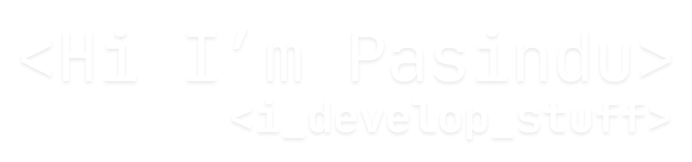

<!-- Replace ./assets/header.png with your actual image path -->

**Data Science Undergraduate | AI/ML Engineer | Full Stack Developer**

## About

**BSc (Hons) Information Technology - Data Science @ SLIIT | 2023 - 2027**

Developing engineering solutions that combine advanced machine learning with modern software engineering. I enjoy building meaningful technology that delivers value through thoughtful design, responsible AI, and scalable architecture.

## GitHub Stats

  
  

## Tech Stack

**Also comfortable with** : TensorFlow, PyTorch, Keras, scikit-learn, Hugging Face, LangChain, CrewAI, GroqAPI, Node.js, Express.js, HTML/CSS, Tailwind CSS,Streamlit, Render, Convex DB, Power BI (Data Visualization)

## Projects Showcase

<table>
  <tr>
    <td align="center" width="33%">
      
       
      <b>MRI Brain Tumor Diagnosis System</b> 
      AI-powered deep learning system using VGG16 transfer learning to classify brain tumors from MRI scans. 
      🔗 <a href="https://github.com/PasinduSuraweera/MRI-Brain-Tumor-Diagnosis-System">Repo</a> | 
      🌐 <a href="https://mri-brain-tumor-diagnosis-system.onrender.com/">Live Demo</a>
       
      Tags: TensorFlow, Deep Learning, Healthcare AI
    </td>
    <td align="center" width="33%">
      
       
      <b>MAIRS - Multi-Agent Research System</b> 
      Advanced AI platform using CrewAI + Groq to automate research, analysis, and report generation. 
      🔗 <a href="https://github.com/PasinduSuraweera/MAIRS-Multi-Agent-Intelligent-Research-System">Repo</a>
       
      Tags: CrewAI, LLM, Multi-Agent Systems
    </td>
    <td align="center" width="33%">
      
       
      <b>EchoChat</b> 
      Modern real-time messaging platform with video calling built on MERN stack with neumorphic UI. 
      🔗 <a href="https://github.com/PasinduSuraweera/EchoChat">Repo</a> | 
      🌐 <a href="https://echochat-kd3r.onrender.com">Live Demo</a>
       
      Tags: MERN Stack, WebSocket, Video Calling
    </td>
  </tr>
  <tr>
    <td align="center" width="33%">
      
       
      <b>LinkedIn Post Generator</b> 
      AI-powered content generator using LangChain and Groq with few-shot learning for personalized posts. 
      🔗 <a href="https://github.com/PasinduSuraweera/Specified-LinkedIn-Post-Generator">Repo</a> | 
      🌐 <a href="https://specified-linkedin-post-generator.streamlit.app">Live Demo</a>
       
      Tags: LangChain, Groq, NLP
    </td>
    <td align="center" width="33%">
      
       
      <b>ImaGen - AI Image Editor</b> 
      Professional image editor with AI background removal, custom backgrounds, and realistic shadow effects. 
      🔗 <a href="https://github.com/PasinduSuraweera/ImaGen-App">Repo</a> | 
      🌐 <a href="https://imagen-image-background-generator.streamlit.app">Live Demo</a>
       
      Tags: Computer Vision, Bria AI, Image Processing
    </td>
    <td align="center" width="33%">
      
       
      <b>EmpManage</b> 
      Employee management system built with Java for efficient workforce administration. 
      🔗 <a href="https://github.com/PasinduSuraweera/EmpManage">Repo</a>
       
      Tags: Java, Enterprise Application
    </td>
  </tr>
</table>

